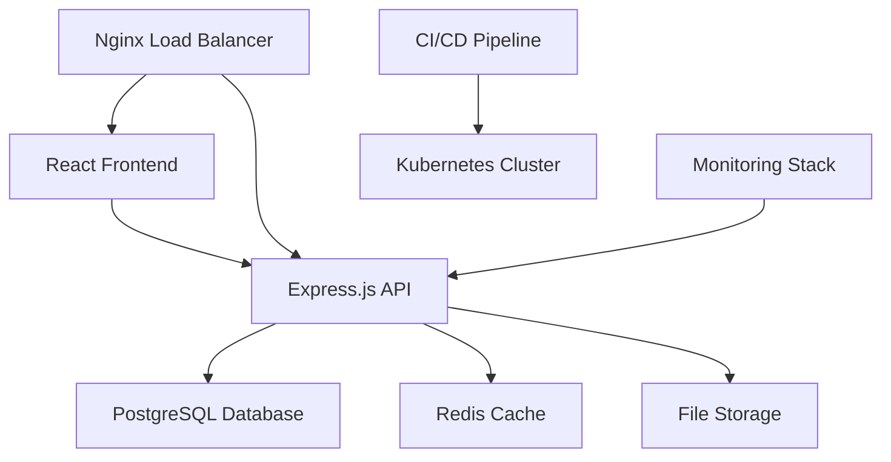

# 📈 Grow - Growth Analytics Platform

[](https://github.com/yassine-devdev/grow/actions)
[](https://github.com/yassine-devdev/grow/actions)
[](https://sonarcloud.io/dashboard?id=grow)
[](https://opensource.org/licenses/MIT)
[](https://nodejs.org/)

> **A comprehensive, production-ready growth analytics platform for tracking and visualizing business metrics, personal development, and performance indicators.**

## 🚀 Features

- **📊 Real-time Analytics Dashboard** - Interactive charts and metrics visualization
- **🔐 Enterprise Authentication** - JWT-based auth with role-based access control
- **📱 Responsive Design** - Mobile-first, accessible UI components
- **🔄 RESTful API** - Comprehensive API with OpenAPI documentation
- **📈 Growth Tracking** - Multiple metric types (revenue, users, performance, etc.)
- **🎯 Goal Management** - Set, track, and achieve growth targets
- **📧 Smart Notifications** - Automated alerts and progress reports
- **🔍 Advanced Filtering** - Time-based analysis and custom date ranges
- **📤 Data Export** - CSV, PDF, and API data export capabilities
- **🌐 Multi-tenant Support** - Organization and team management

## 🏗️ Architecture



## 🛠️ Tech Stack

### **Frontend**
- **React 18** with TypeScript
- **Material-UI v5** for components
- **Redux Toolkit** for state management
- **React Query** for data fetching
- **Chart.js** for data visualization
- **React Hook Form** for form handling

### **Backend**
- **Node.js 18+** with Express.js
- **TypeScript** for type safety
- **PostgreSQL 15** with Prisma ORM
- **Redis** for caching and sessions
- **JWT** for authentication
- **Winston** for logging
- **Joi** for validation

### **DevOps & Infrastructure**
- **Docker** for containerization
- **Kubernetes** for orchestration
- **GitHub Actions** for CI/CD
- **Nginx** for reverse proxy
- **Prometheus & Grafana** for monitoring
- **SonarCloud** for code quality

## 📋 Prerequisites

- **Node.js** >= 18.0.0
- **PostgreSQL** >= 13
- **Redis** >= 6.0
- **Docker** >= 20.10 (for containerized deployment)
- **Git** >= 2.30

## 🚀 Quick Start

### 1. Clone and Setup
```bash
git clone https://github.com/yassine-devdev/grow.git
cd grow
npm install
```

### 2. Environment Configuration
```bash
cp .env.example .env
# Edit .env with your configuration
```

### 3. Database Setup
```bash
npm run db:setup
npm run db:migrate
npm run db:seed
```

### 4. Development Server
```bash
npm run dev
```

Visit `http://localhost:3000` for the frontend and `http://localhost:8000/api` for the API.

## 📚 Documentation

- **[API Documentation](./docs/api.md)** - Complete API reference
- **[Deployment Guide](./docs/deployment.md)** - Production deployment instructions
- **[Contributing Guide](./CONTRIBUTING.md)** - How to contribute to the project
- **[Architecture Overview](./docs/architecture.md)** - System design and patterns
- **[Security Policy](./SECURITY.md)** - Security guidelines and reporting

## 🧪 Testing

```bash
# Run all tests
npm test

# Unit tests
npm run test:unit

# Integration tests
npm run test:integration

# E2E tests
npm run test:e2e

# Coverage report
npm run test:coverage
```

## 🚀 Deployment

### Docker Deployment
```bash
docker-compose up -d
```

### Kubernetes Deployment
```bash
kubectl apply -f k8s/
```

### Manual Deployment
See [Deployment Guide](./docs/deployment.md) for detailed instructions.

## 📊 Monitoring

- **Health Check**: `GET /api/health`
- **Metrics**: `GET /api/metrics`
- **Logs**: Available via Winston logger
- **Performance**: Monitored via Prometheus

## 🔒 Security

- **Authentication**: JWT with refresh tokens
- **Authorization**: Role-based access control (RBAC)
- **Data Validation**: Comprehensive input validation
- **Rate Limiting**: API rate limiting implemented
- **HTTPS**: SSL/TLS encryption enforced
- **Security Headers**: Helmet.js security headers
- **Dependency Scanning**: Automated vulnerability checks

## 🤝 Contributing

We welcome contributions! Please see our [Contributing Guide](./CONTRIBUTING.md) for details.

1. Fork the repository
2. Create a feature branch (`git checkout -b feature/amazing-feature`)
3. Commit your changes (`git commit -m 'Add amazing feature'`)
4. Push to the branch (`git push origin feature/amazing-feature`)
5. Open a Pull Request

## 📄 License

This project is licensed under the MIT License - see the [LICENSE](./LICENSE) file for details.

## 🆘 Support

- **Documentation**: [docs/](./docs/)
- **Issues**: [GitHub Issues](https://github.com/yassine-devdev/grow/issues)
- **Discussions**: [GitHub Discussions](https://github.com/yassine-devdev/grow/discussions)
- **Email**: support@grow-platform.com

## 🗺️ Roadmap

- [ ] **v1.0** - Core analytics platform
- [ ] **v1.1** - Advanced reporting features
- [ ] **v1.2** - Mobile application
- [ ] **v2.0** - AI-powered insights
- [ ] **v2.1** - Third-party integrations

## 📈 Performance

- **API Response Time**: < 200ms (95th percentile)
- **Database Queries**: Optimized with indexing
- **Frontend Bundle**: < 500KB gzipped
- **Lighthouse Score**: 95+ across all metrics

---

**Built with ❤️ by the Grow Team**